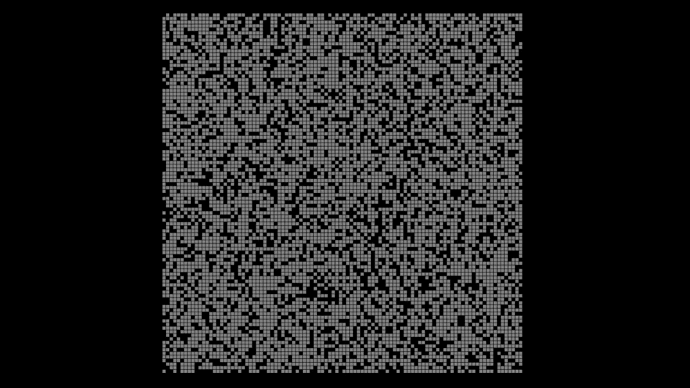

# A* Pathfinder

My implementation of the A* pathfinder algorithm using python and the pygame library for the visuals of the maze. The algorithm runs on a 100x100 randonly generated maze, starting from the top left of the maze and ends when a path to the bottom right of the maze is found or no path at all is found.

## The algorithm running


## TODOs
- [ ] Window to select start and end of the A*
- [ ] Switch the function ```get_min_f(open_set)``` to a priority queue for better performance
- [ ] Checkfor a better heuristic
- [ ] Better implementation of the maze with support for different sizes
- [ ] Better maze generation to reduce the number of mazes with no paths